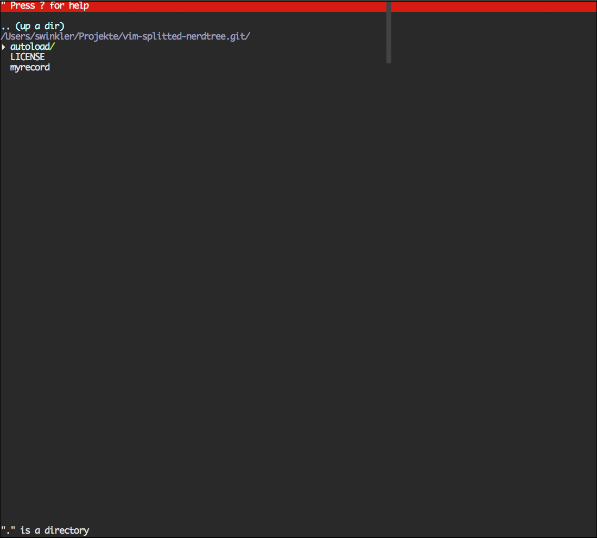

vim-splitted-nerdtree
=====================

Use NERDTree as your split explorer!



After watching [Vimcasts: The file explorer](http://vimcasts.org/episodes/the-file-explorer/) and reading through [Practical Vim: Tip 43](https://pragprog.com/book/dnvim/practical-vim) I wanted to make NERDTree my split explorer of choice, but some functionality was missing. Files could not be revealed with `NERDTreeFindFile` without opening a new NERDTree buffer, CtrlP would create new splits instead of reusing NERDTree buffers and I had let NERDTree hijack NetRW to get rid of it. 

So I wrote a small plugin to clean up my `.vimrc`

Use the package manager of your choice to source this plugin (you need NERDTree of course):

```
Bundle 'scrooloose/nerdtree'
Bundle 'svenwin/vim-splitted-nerdtree'
```

Bind your prefered key sequence:

```
nmap <leader>n :call splittednerdtree#revealFile()<CR>
```


